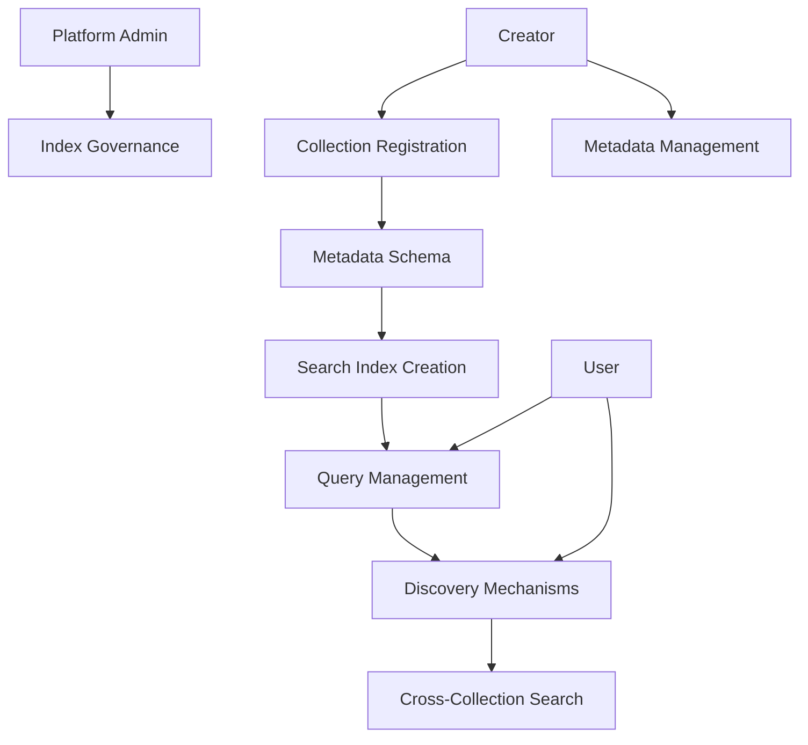

# Search Authority

A decentralized platform for advanced NFT search, discovery, and metadata indexing on the Stacks blockchain.

## Overview

Search Authority is an innovative blockchain-native solution that enables sophisticated NFT discovery through rich, on-chain metadata and advanced querying mechanisms. By providing a standardized approach to NFT metadata indexing, the platform empowers users, developers, and collectors to find and interact with digital assets more effectively.

### Key Features
- Standardized NFT metadata indexing
- Advanced search and filtering capabilities
- Decentralized collection registration
- Flexible metadata schema support
- On-chain search index management
- Cross-collection discovery mechanisms

## Architecture

The platform leverages a single smart contract to manage NFT collection metadata, search indices, and discovery protocols.



## Contract Documentation

### Core Contract: search-authority.clar

#### Purpose
Manages decentralized NFT search and discovery infrastructure, enabling advanced metadata indexing and cross-collection querying.

#### Key Components
1. **Collections**: Stores collection metadata and search parameters
2. **Metadata Schemas**: Defines flexible metadata structures
3. **Search Indices**: Manages searchable metadata mappings
4. **Discovery Protocols**: Handles cross-collection search mechanisms
5. **Governance**: Supports platform-wide index management

## Getting Started

### Prerequisites
- Clarinet installed
- Stacks wallet for deployment/interaction
- Basic understanding of NFT metadata standards

### Usage Examples

1. Register a Collection:
```clarity
(contract-call? .search-authority register-collection 
    "Digital Art Archives"
    "Comprehensive digital art metadata index"
    {
        category: "Art",
        tags: ["digital", "contemporary"],
        search-weights: {
            title: u10,
            artist: u8,
            year: u5
        }
    }
)
```

2. Add Searchable Metadata:
```clarity
(contract-call? .search-authority add-metadata 
    u1  ;; collection-id
    {
        title: "Algorithmic Landscape",
        artist: "AlgoArt Studios",
        year: u2023,
        style: "Generative"
    }
)
```

3. Query Metadata:
```clarity
(contract-call? .search-authority search-metadata 
    {
        category: "Art",
        tags: ["digital"],
        min-year: u2020
    }
)
```

## Function Reference

### Collection Management
- `register-collection`: Register a new searchable collection
- `update-collection-metadata`: Modify collection search parameters
- `get-collection`: Retrieve collection details

### Metadata Operations
- `add-metadata`: Add searchable metadata for an NFT
- `update-metadata`: Modify existing NFT metadata
- `remove-metadata`: Delete NFT metadata

### Search Mechanisms
- `search-metadata`: Perform advanced metadata search
- `get-search-index`: Retrieve current search indices
- `filter-collections`: Apply cross-collection filters

### Administrative
- `set-search-weights`: Adjust metadata search weights
- `manage-index-governance`: Update platform search rules

## Development

### Local Testing
```bash
# Run local tests
clarinet test

# Check contract
clarinet check
```

### Deployment
```bash
# Deploy to testnet
clarinet deploy --testnet

# Deploy to mainnet
clarinet deploy --mainnet
```

## Security Considerations

### Design Principles
- Metadata is public and verifiable
- Search weights prevent metadata manipulation
- Decentralized governance model
- Flexible but secure metadata schemas

### Best Practices
1. Use consistent metadata structures
2. Implement rate limiting for searches
3. Validate metadata before indexing
4. Monitor search index performance
5. Encourage community-driven governance

### Privacy & Transparency
- All metadata is public on-chain
- No personal identifying information stored
- Search mechanisms are fully transparent
- Metadata can be updated by collection owners